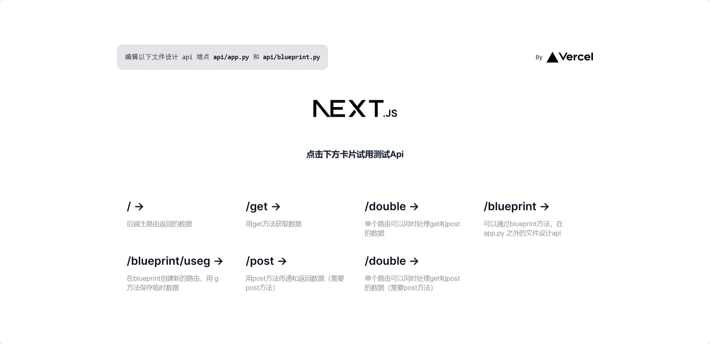

# Clean Flask with Vercel 

这个项目能让你迅速启用一个基于 Python 的后端接口，为你的网站提供基于 Python 服务器支持。欢迎⭐！

项目在 vercel 官方推出的模板 [Flask Hello World](https://vercel.com/templates/python/flask-hello-world) 基础上进行改进，修复了一些bug。你也可以参考 Vercel 文档中关于 [Python Runtime](https://vercel.com/docs/concepts/functions/serverless-functions/runtimes/python) 的说明。

同时应用了 Flask 3.0 官方文档中 [Flask Tutorial](https://flask.palletsprojects.com/en/3.0.x/tutorial/) 中提到的方法。

项目有如下特性：

- 修复了官方模板 pyhton 版本不适配的 bug ：现在你可以在 vercel 上直接部署上线。

- 增加蓝图文件：提供可拓展性，通过 blueprint.py 文件增加新的路由，更清晰的结构、更具拓展性。

- 方便的 Debug 文件：现在你可以直接在 `debug/apitest.http` 文件中测试api，而不必到网页上测试

# Demo

[示例网站地址](https://demo-flask-vercel.sawana.site/)



## 直接部署生效

你可以直接将clone或者fork本项目，在自己的 vercel 上部署运行，并尝试访问。

这个例子使用了Web服务器网关接口（WSGI）与Flask结合，在Vercel上使用无服务器函数来处理请求。 

主程序在 `api/app.py`

以下路由可以尝试访问：
```bash
/ # 首页路由
/get # GET 请求方法
/post # POST 请求方法
/double # 同时接收和处理 GET 和 POST 请求
/blueprint # 在 blueprint 文件中编写路由
/blueprint/useg # blueprint 的更长路由 / 使用 g 参数
```

## 本地运行 

```bash
npm i -g vercel
vercel dev
```

会出现几个设置问题，设置完毕后，你可以通过这个网址接收数据： `http://localhost:3000`.

## Debug 测试

我们通过 REST CLIENT ( Huachao Mao ) 插件进行网站测试，熟悉它之后，你会知道它有多么方便！

在 `debug/apitest.http` 中使用。点击 `### name` 下的 `Send Request`。

## 关于配置

为了让项目可以被顺利访问，我主要改动了下面两个文件，如果你需要在这个项目的基础上拓展，请随意改动和调试下面的文件。

### `vercel.json`

```json
{
  "version": 2,
  "builds": [
    { "src": "api/app.py", "use": "@vercel/python", "config": { "maxLambdaSize": "15mb", "runtime": "python3.9" } },
    { "src": "api/blueprint.py", "use": "@vercel/python", "config": { "maxLambdaSize": "15mb", "runtime": "python3.9" } }
  ],
  "routes": [
    { "src": "/(.*)", "dest": "api/app.py" }
  ]
}
```

builds: 为了让 python 文件顺利运行，你需要“标记”它们，告诉 vercel 怎么运行他们。`{ "src": "api/app.py", "use": "@vercel/python", }`。另外，记得将 `runtime` 设置为 python 3.9。

### `package.json`

```json
{
  "engines": {
    "node": "18.x"
  }
}
```

node 20.x 版本在vercel上无法识别 python 3.9，我们在这里指定 node 版本。

## 联系方式

我是一个正在学习和实现网站开发的开发者，希望在今年运营出一个 MRR $100 的作品。

如果你发现了什么问题、可改进的地方，或者只是想随意地聊聊天，都非常欢迎联系我！

[即刻 @Sawana](https://okjk.co/Mx4XUR)

[X @HSawana9](https://twitter.com/HSawana9)
